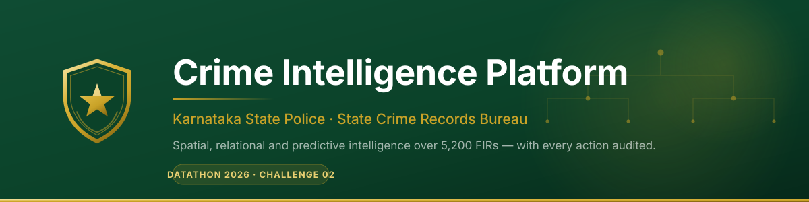

<p align="center">
  
</p>

<p align="center">
  <a href="https://ksp-crime-intelligence-60078249847.development.catalystserverless.in/app/index.html"></a>
  
  
  
</p>

---

##  What this is

A crime intelligence platform for the **Karnataka State Police State Crime Records Bureau**, built for **Datathon 2026 · Challenge 02**.

It replaces siloed Excel reporting with a system that answers the three questions a police bureau actually asks: *where is crime concentrated and when*, *who is connected to whom*, and *who did what to this case file*.

**Live:** https://ksp-crime-intelligence-60078249847.development.catalystserverless.in/app/index.html

| Sign in as | Email | Commands | On the featured case |
|---|---|---|---|
| Sub-Inspector, Indiranagar PS | `amaan.k2405@gmail.com` | 1 station | **allowed** |
| ASP, Bengaluru South Division | `amaank2405@gmail.com` | 7 units | **refused** |
| DGP, SCRB | `a.maank2405@gmail.com` | all 44 units | **allowed** |

Password for all three: `Ksp@Datathon2026`

> The middle row is the point. An ASP **outranks** a Sub-Inspector and is still refused, because authority follows position in the command tree, not rank. See [Role-based access](#-role-based-access-is-real).

---

##  The problem

The challenge brief describes an analytical ecosystem with four failures. Each maps to something concrete here:

| Stated problem | What we built |
|---|---|
| Data silos, Excel-based reporting | One integrated store; every view is a live query |
| No AI-driven analysis of behaviour or networks | Entity resolution + co-accused network graph (F1 **0.943**) |
| SCRB receives fragmented information | State → city → division → station drilldown from one tree |
| Policing is reactive, not proactive | Spatiotemporal hotspots with peak-hour windows and risk scoring |

---

##  What it does

**Spatiotemporal hotspots.** A heatmap over 5,200 FIRs with a 24-hour scrubber and crime-head filter. Play the animation and offence clusters migrate across the city as the day advances — the visual argument for shift-based deployment. Switch the surface to counted clusters, at zone or district granularity, when you need numbers rather than a gradient.

**Zone drilldown.** Any zone opens to per-station intelligence: crime-head split, peak window derived from actual incident hours, investigation status mix, and recent FIRs. A heatmap says *where*; this says *what, when, and how far along*.

**Criminal network analysis.** The schema has **no person identity** — each accused row is bound to one case. Identity across FIRs is reconstructed, then co-accused links are drawn into a navigable network.

**Case file with real writes.** Notes, status changes and case closure persist to Catalyst Data Store, appear in the case timeline, and are recorded in an audit trail.

**Audit trail.** Every write **and every refused attempt**, with officer, unit, timestamp and outcome.

---

##  Role-based access is real

The brief asks for *"role-based access for investigators, analysts, supervisors and policymakers… with audit logs and traceability."* Most submissions will show a role dropdown. This derives authority from the data model itself.

`Unit.ParentUnit` is a self-referencing hierarchy — it **is** the police command tree. A signed-in officer resolves to a unit, and their authority is the subtree beneath it:

```
Karnataka State Police            ← DGP / SCRB sees all 44 units
└── Bengaluru City Police
    ├── Bengaluru South Division  ← ASP sees this subtree
    │   ├── Jayanagar PS
    │   └── JP Nagar PS …
    └── Bengaluru East Division
        └── Indiranagar PS        ← SI sees one station
```

Every mutating request follows one path, server-side:

```
session → AppUser row → case's station (bundled map) → subtree test → write → audit
```

Three properties make this more than decoration:

1. **The client never asserts identity.** Unit and rank are read from the Catalyst session on every request. A crafted request body cannot widen scope.
2. **The station is never taken from the request.** It comes from a `CaseMasterID → PoliceStationID` map bundled with the function, so naming an arbitrary case id cannot escape your own command.
3. **Refusals are recorded.** A denied action writes an `AuditLog` row with `Outcome='deny'`. A successful action proves nothing about access control; a recorded refusal proves the check ran.

<sub>Enforcement is asserted by tests, not just claimed — see `catalyst-app/functions/kspwrite/scope.test.js`, including *"command position, not rank, decides access to the featured case"*.</sub>

---

##  Architecture

```
Browser  (catalystserverless.in/app/)
   │
   ├── GET reads ─────────────► AppSail  "kspapi"      SQLite via sql.js (WASM)
   │                                                    analytics, hotspots, cases
   │
   └── writes + session ──────► Function "kspwrite"     SAME ORIGIN
                                   ├── Catalyst Authentication   identity
                                   ├── Catalyst Data Store       notes, status, audit
                                   └── org.json / case-station.json   scope, never client input
```

**Why writes live in a Function rather than in AppSail.** The SPA is served from `catalystserverless.in`; the read API from `catalystappsail.in`. Catalyst's session cookie is scoped to the Web Client Hosting domain and is **never sent cross-site** to AppSail. Any design that POSTs from the browser straight to the read API arrives anonymous, and `catalyst.initialize(req)` cannot resolve a user. Advanced I/O Functions are served at `/server/<name>` on the *same* origin, so the cookie flows and identity resolves with no token juggling.

This also means the read path never changed while writes were added.

### Catalyst services

Per the mandated capability → service table:

| Capability | Service | Used for |
|---|---|---|
| Frontend / SPA | **Web Client Hosting** | React app under `/app/` |
| Web app in a managed runtime | **AppSail** | Read API over the case database |
| Serverless backend logic | **Serverless Functions** (Advanced I/O) | Authenticated write layer |
| Relational database | **Data Store** (ZCQL) | Notes, status changes, profiles, audit |
| User auth / login | **Authentication** (Embedded) | Officer sign-in; we never handle a password |
| Object storage | **Stratus** | Bulk seed staging |

---

##  The data

No real crime data exists for this challenge — only a schema. So the generator is a first-class component, not a fixture.

| | |
|---|---|
| FIRs | **5,200** across 37 stations, Jun 2025 – Jul 2026 |
| Accused / victims | 7,230 / 7,819 |
| Command units | 44 (1 state, 1 city, 5 divisions, 18 stations, 19 district units) |
| Officers | 120 |
| Tables | 36, schema-conformant to the published ER diagram |

Two properties matter more than volume:

**It is reproducible.** Two builds under different `PYTHONHASHSEED` values produce byte-identical data. This was not free — `transliteration_variants()` returned an unsorted `set`, and because CPython salts string hashing per process, `rng.choice()` recorded different name spellings on every run despite a fixed seed. Three consecutive builds produced 1,581 / 1,590 / 1,614 resolved persons before the fix. Now pinned, and asserted by `pipeline/test_determinism.py`.

**FIR numbers behave like real ones.** `CaseNo` is unique per station per year — two stations both hold an FIR 1/2026, exactly as in the real register — and `CrimeNo` embeds the same serial so a case's two numbers can never contradict each other.

### Entity resolution

The hardest requirement, because the schema gives no person key. Names recur as transliteration variants (`Ravi Kumar` / `RaviKumar` / `Ravi Kumara`).

Blocking on gender + name prefix, Jaro-Winkler taken as `min(forward, reversed)` so the surname must agree too — plain JW over-weights a shared prefix and merges *Venkatesh Nayak* with *Venkatesh Achar* — then union-find clustering with an age-consistency guard.

Measured against generator ground truth:

| Precision | Recall | F1 | Resolved | True |
|---|---|---|---|---|
| **0.934** | **0.953** | **0.943** | 1,634 | 1,393 |

---

##  Stack

**Frontend** React 19 · TypeScript · Vite · Leaflet + leaflet.heat · hand-built SVG charts (no chart library)
**Backend** Node 20 · Express · `sql.js` (WASM SQLite — AppSail's managed runtime cannot build native modules) · `zcatalyst-sdk-node`
**Pipeline** Python 3, standard library only — Jaro-Winkler and union-find are implemented locally rather than pulled in

~9,600 lines across app, API and pipeline.

---

##  Run it locally

```bash
python pipeline/build.py
```

```bash
cd server && npm install && npm start
```

```bash
cd client && npm install && npm run dev
```

The app runs at `http://localhost:5173`, proxying `/api` to the local server on `:4000`.

Sign-in and write actions need Catalyst hosting; locally they degrade to honest read-only messages rather than breaking. Deployment and console setup are in [`docs/writes-and-auth-runbook.md`](docs/writes-and-auth-runbook.md).

---

##  Tests

```bash
cd catalyst-app/functions/kspwrite && npm test   # 13 — scope enforcement + data invariants
cd server && npm test                            # 7  — FIR uniqueness, launch behaviour
cd pipeline && python -m unittest test_determinism  # 3 — reproducibility across hash seeds
```

**23 passing.** They cover the properties that would be embarrassing to get wrong: that an unknown unit yields *empty* scope rather than global scope; that a South-division ASP is refused on an East-division case; that every case maps to a station that exists in the org tree; and that two builds under different hash seeds are identical.

---

##  Demo

The five-minute walkthrough, with timings and the exact narration, is in [`docs/demo-script.md`](docs/demo-script.md).

Short version: sign in as the Sub-Inspector, add a note to a case in your own station — it persists. Sign in as the ASP, who outranks you, and the same action on that case is refused. Sign in as SCRB and it succeeds. Open the Audit Trail: all three, with officer, unit, time and outcome.

---

##  What we did **not** build

Stated plainly, because a labelled gap is more credible than a half-working feature:

- **Password changes** are delegated to Catalyst's own reset flow. This codebase contains no password field and never handles a credential.
- **Document upload** is labelled in-product as not in this build.
- **Financial transaction analysis** (framework item 7) has no schema support — there is no transaction table in the published ER diagram.
- Data is **synthetic**. The system is schema-conformant by construction, so real SCRB extracts drop in by swapping the source.

---

##  Repository

```
pipeline/        synthetic generation, entity resolution, precompute (Python)
server/          read API over SQLite (local dev + static export)
client/          React SPA
catalyst-app/
  appsail/       deployed read API
  functions/
    kspwrite/    authenticated write layer + scope enforcement
  client/        deployed SPA bundle
docs/            architecture, design specs, runbook, demo script
```

Design rationale lives in [`architecture.md`](architecture.md), [`design.md`](design.md), and
[`docs/design/access-control-and-writes.md`](docs/design/access-control-and-writes.md).

---

##  A note on the emblem

The mark used throughout is a **stylised shield-and-star, not the Karnataka State Police emblem**. A 2022 Government of Karnataka circular, citing the State Emblem of India (Prohibition of Improper Use) Act, 2005, reserves the real emblem for government departments absent prior permission. Nothing here reproduces the Gandaberunda or the Ashoka Lion Capital. It should be swapped for the official emblem only once KSP authorises its use.

---

<p align="center">
  <sub>Built for Datathon 2026 · Karnataka State Police · State Crime Records Bureau</sub>
</p>
